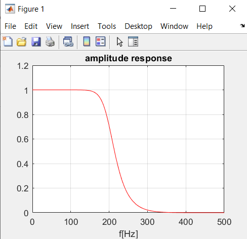
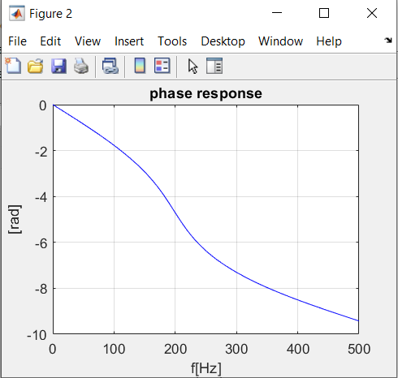
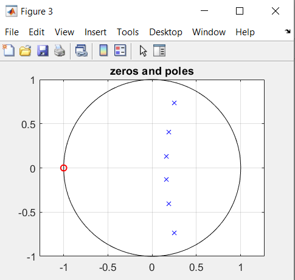
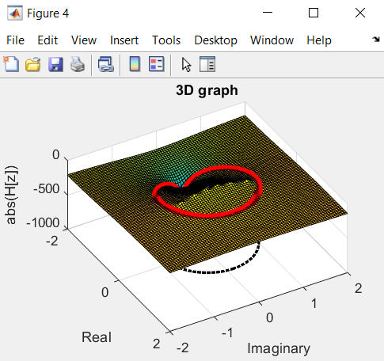
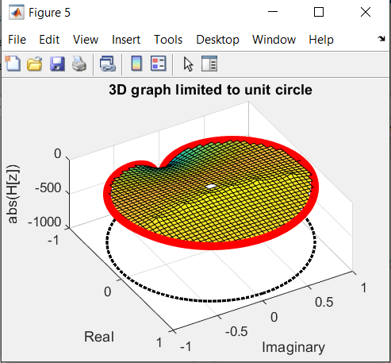

# Z-transform visualization
The purpose of this project was to create a visualization of filter's transfer function. Matlab has been used as a programming environment. The function responsible for calculations and visualizations accepts coefficients of digital filter as an input and then displays visualization of its characterics.

## Forms of visualization
- amplitude response

- phase response

- zeros and poles on the complex plane

- 3D visualization of the Z-transform

- 3D visualization of the Z-transform but limited to the unit circle
- 

## Structure of files
- execute.m - this m-file needs to be run in order to see the visualization. This is where coefficients of the filter need to be provided (it can be provided in the form of zeros and poles or in a form of numerator and denominator of the transfer function)
- transfer_function.m - function responsible for calculations and visualization
- num_denum.m - utility function responsible for calculating numerator and denominator of the transfer function
